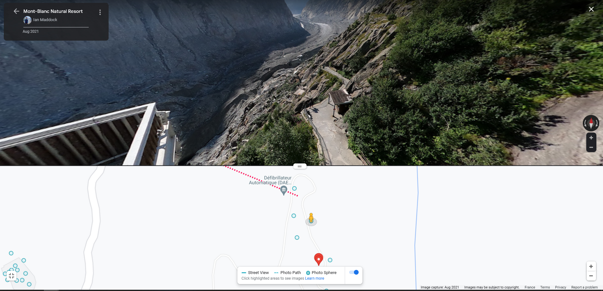

# Ice Ice baby

##### OSINT / GeoInt (easy)

````
During his winter holiday, David left a DaVinciCode sticker on a pillar, can you find the coordinates where he left it?
Flag format:  ``dvCTF{X°X'X"N_X°X'X"E}``
X is always an integer
````


### Writeup

Google reverse search first result is "Chamonix mer de glace", going over maps confirms the location. To find the precise sticker location, we use street view and locate the pillar on this street view image:




### Flag

``dvCTF{45°55'52"N_6°55'13"E}``


Easter eggs have been added to the metadata:

```
$ exiftool .\image.jpg
ExifTool Version Number         : 12.08
File Name                       : image.jpg
Directory                       : .
File Size                       : 2035 kB
File Modification Date/Time     : 2023:02:05 22:23:38+01:00
File Access Date/Time           : 2023:02:05 22:23:39+01:00
File Creation Date/Time         : 2023:02:05 21:31:01+01:00
File Permissions                : rw-rw-rw-
File Type                       : JPEG
File Type Extension             : jpg
MIME Type                       : image/jpeg
Current IPTC Digest             : 3f7c0fd710757ec44a695c0d3ed28a0a
Copyright Notice                : RGF2aWQgQ2luY29kZSB3YXMgaGVyZQ==
Application Record Version      : 4
XMP Toolkit                     : Image::ExifTool 12.08
Location                        : Come on it can't be that easy ;)
Image Width                     : 3472
Image Height                    : 4624
Encoding Process                : Baseline DCT, Huffman coding
Bits Per Sample                 : 8
Color Components                : 3
Y Cb Cr Sub Sampling            : YCbCr4:2:0 (2 2)
Image Size                      : 3472x4624
Megapixels                      : 16.1
```

