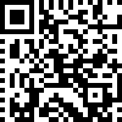

# Write-up

## Introduction

The goal of the challenge is to understand how the program generate a QRCode in order to decode the given one. 

`Flag: dvCTF{I_L0v3_Qr_c0d3!!!!!!!!}`

## Solution

**DISCLAIMER: All the captures contain the name of the functions because I didn't intend to strip them when writing the WU but I finally decided to strip them. It doesn't change anything in the way the program works.**

We start by opening the program with a tool such as IDA or Ghidra. We can notice that the names of the functions are not strip and we can easily locate the main function: **qr_code::main::had69fc65e355d1be()**. The program only contains two function from "qr_code".

One function is the main and the other one is a function that takes an array of pixel, a x and a y coordinate and set the pixel color to white at this coordinate.

The program asks for a string of 30 characters maximum. If the length is above 30, only the first 30 chars are kept. This text will then be encoded in the QR Code.

Then, we can notice that the program allocate memory (120 000 bytes which is the image size 200\*200\*3) that will contains the pixels of the image. 

After that, the program iterates over each pixel and set them to black.

Then, the program draws the different pattern of the QRCode (timing, alignment and finder) which is not an interesting part for us. After that, the program starts to build the string that will contains the data written to the QRCode. First, it gets the current timestamp in nano seconds and generate 16 random bytes.

The timestamp value is then formatted to string as a u64 binary.

and each byte form the array to string as a u8 binary. Those string are added together.

After that, we notice that it starts ciphering the input that we gave him by using the timestamp as a key and the random bytes array as an IV.

The output of the cipher is then formated to binary and added to the string that contained the timestamp and the random bytes. Then, It generates random bytes added to the string until the length of the string is 479.

Finally, the program writes the content of the string in the QRCode. The only things is that the data are written from right to left instead of down to up. To decode the data, I wrote a program in Rust that reads the data from the QRCode and decipher the data.